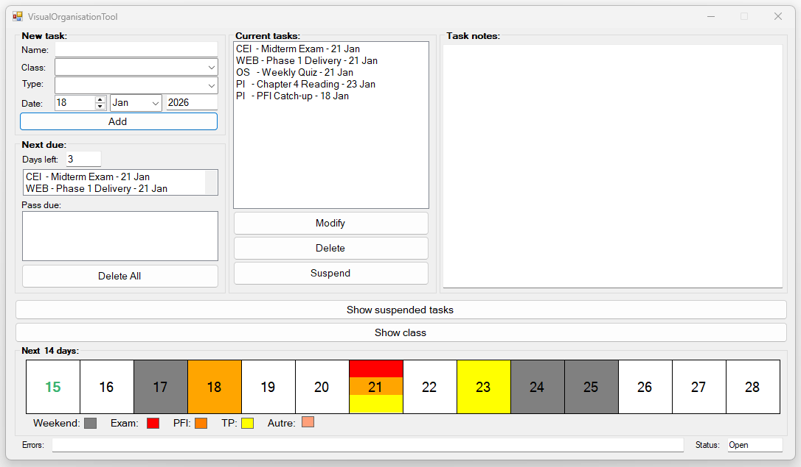
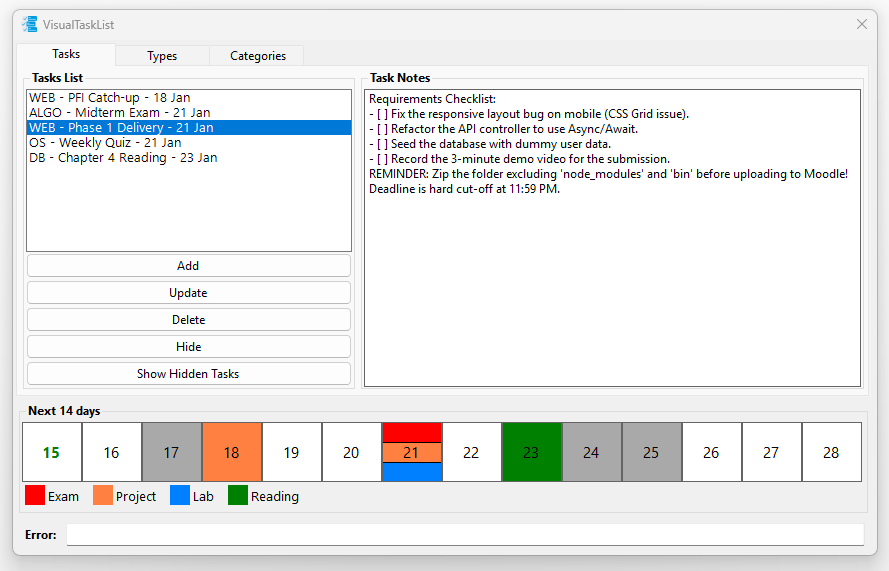

# VisualTaskList-Evolution

A personal task management evolution showcasing my transition from basic scripts to a structured, professional software architecture.

## Project Overview
Originally created to replace disorganized text files, this repository contains two versions of my task manager. It serves as a visual timeline of my growth as a developer.

## The Evolution

### 1. Legacy Version (VisualOrganisationTool)

* **The "Why":** Built to solve a personal need to stay organized during my early studies.
* **Tech:** .NET Framework 4.7.2, Windows Forms.
* **Focus:** Core functionality and UI basics.

### 2. Current Version (VisualTaskList)

* **The "Why":** A complete rewrite to implement industry-standard design patterns and modern frameworks.
* **Tech:** .NET 8.0, SQLite.

## Improvements
* **Architecture:** Implemented the Model-View-Presenter (MVP) pattern.
* **Data Integrity:** Moved from local files to a structured SQLite database.
* **Scalability:** Extensive use of Interfaces for easier testing.
* **Custom UI:** Developed modular views and custom calendar controls.

## Tech Stack
* **Language:** C#
* **Framework:** .NET 8.0 (Windows Forms)
* **Database:** SQLite
* **Patterns:** MVP, Repository Pattern, Dependency Inversion.

## Structure
* `/VisualTaskList`: The modern, refactored implementation.
* `/VisualOrganisationTool_Legacy`: The original project files for comparison.

## How to Run
1. Clone the repository.
2. Open `VisualTaskList.sln` in Visual Studio 2022.
3. Build and Run.
